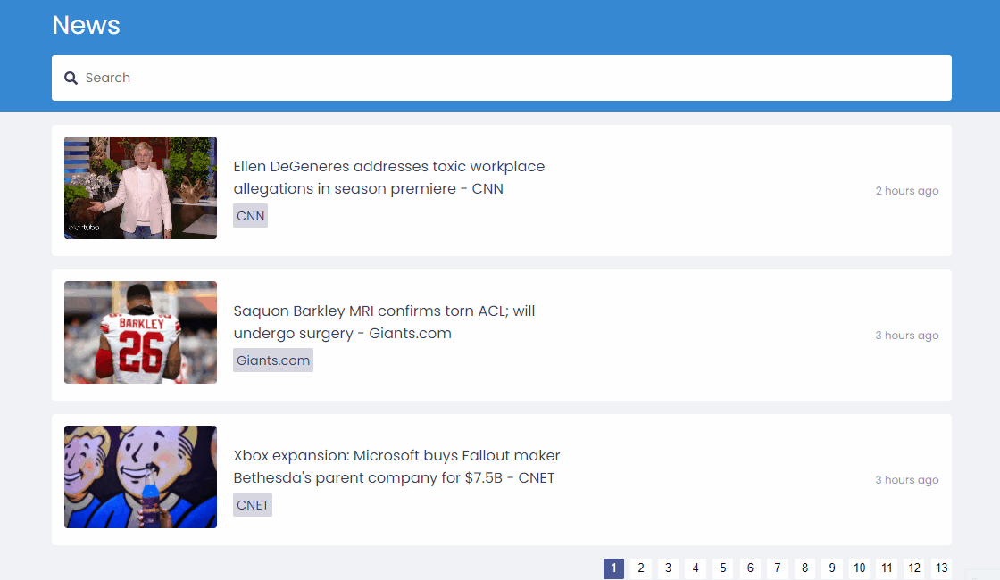

<h1>News App</h1>

</hr>

<a href="https://news-app-puifwoij8.vercel.app/"><h2>Demo</h2></a>


> <h2>Esse projeto foi desenvolvido com as seguintes tecnologias</h2>

</hr>

- Javascript
- React
- React Hooks
- Context API
- Axios
- Moment.js
- News API

  <br>

> <h2>Configuração</h2>

 <br>

```
execute yarn para instalar as dependências
```

```
execute yarn start para iniciar a aplicação
```

```
Abra http://localhost:3000 para visualizá-lo no navegador.
```
